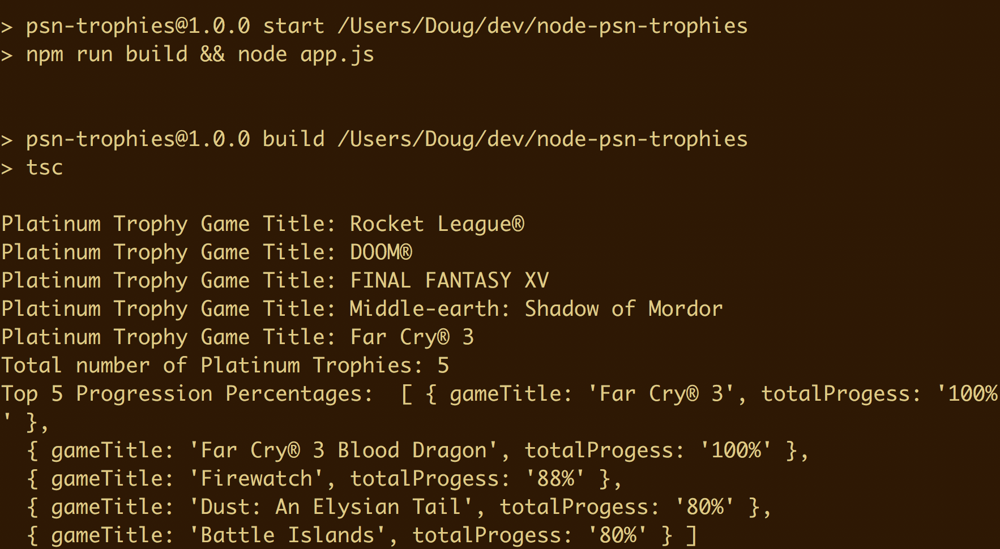

## node-psn-trophies
Node project, written in typescript, that pulls in Playstation trophies. A token is required to make authenticated requests to Sony's API. This is defined near the top of the app.ts file. I found it difficult to find out how many Platinum trophys I had across the 3 platforms (PS3, PS4 and PS Vita) via my.playstation.com, so I decided to make this script that made it quick and easy. It prints the game titles of users platinum trophies. It also prints top 5 titles with the most in game progression (this includes DLC). 

After successfully retrieving the trophy, this script saves the trophy json to a file called trophies.json. If you want to update trophy information, delete this file and rerun.

# Token
To get a token, go to https://my.playstation.com/ and login. Then open Chrome Dev Tools -> Network Tab. Click on the GET request to profiles2 and then scroll down to the Request headers, there is a Bearer token which will look like `authorization: Bearer <token>`. Enter the value of this token in the app.ts file (don't include Bearer prefix).

# Run
To build and run, 
```
npm install && npm start
```

# Screenshots

